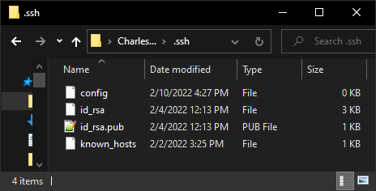
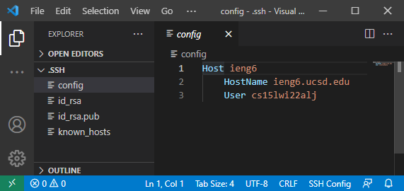
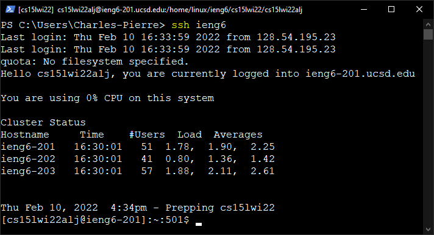
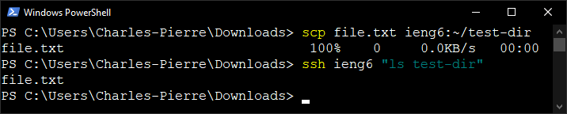

# Lab Report 3 Week 6

## Streamlining `ssh` Configuration

The first step in streamlining `ssh` configuration is to create a `config` file in the `.ssh` directory.

The `config` file is edited to add an entry that tells `ssh` to use an alias for a specific hostname, and what username to use when logging in to that host's server.

The alias can then be used with `ssh` to log in to the remote server.

The alias can also be used with `scp` to copy files to directories on the remote server.

