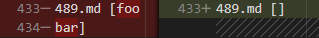

# Lab Report 5 Week 10

In this report, the implementations of markdown-parse in [my repository](https://github.com/PierreBeur/markdown-parse) and the [provided repository](https://github.com/ucsd-cse15l-w22/markdown-parse) were compared using the tests provided from the commonmark-spec. The tests with different results were found programmatically by adding a method to and modifying the main method of each implementation.

```java
public static void printLinks(File file) throws IOException {
    Path filePath = file.toPath();
    String fileName = filePath.getFileName().toString();
    int lastDot = fileName.lastIndexOf(".");
    if (lastDot != -1 && fileName.substring(lastDot).equals(".md")) {
        String contents = Files.readString(filePath);
        ArrayList<String> links = getLinks(contents);
        fileName = String.format("%-7s", fileName);
        System.out.println(fileName+links);
    }
}

public static void main(String[] args) throws IOException {
    File dirOrFile = new File(args[0]);
    if (dirOrFile.isDirectory()) {
        for (File f: dirOrFile.listFiles()) {
            printLinks(f);
        }
    } else {
        printLinks(dirOrFile);
    }
}
```

The tests for each implementation were run using

```
java MarkdownParse test-files/ > results.txt
```

The results were then compared with the diff panels in VSCode.


## Test 489

```md
[link](foo
bar)
```


For test 489, only the provided implementation is correct, with the expected output of `[]`. The problem with my implementation is that it does not require links not to contain the newline character `\n`. This bug could be fixed by making the following change shown in the comment.
```java
if (!link.contains(" ") /* && !link.contains("\n") */ ) {
    toReturn.add(link);
}
```

## Test 510

```md
[link] (/uri)
```


For test 510, only my implementation is correct, with the expected output of `[]`. The problem with the provided implementation is that it does not require the
link to have no characters between the closed bracket and open parenthesis. This bug could be fixed by adding a statement to ensure that the open parenthesis has an index one greater than that of the closed bracket to the code below.
```java
int nextCloseBracket = markdown.indexOf("]", nextOpenBracket);
int openParen = markdown.indexOf("(", nextCloseBracket);
```